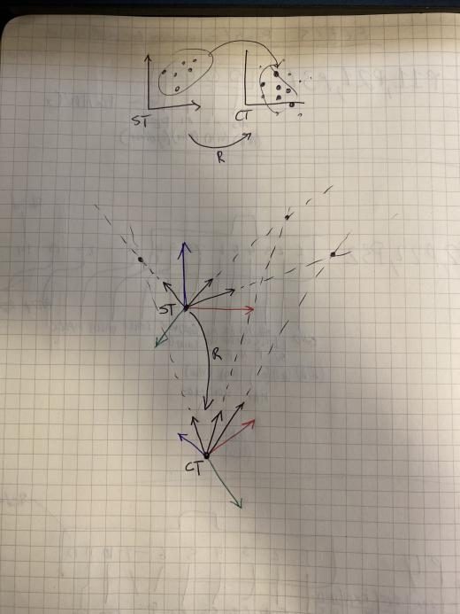
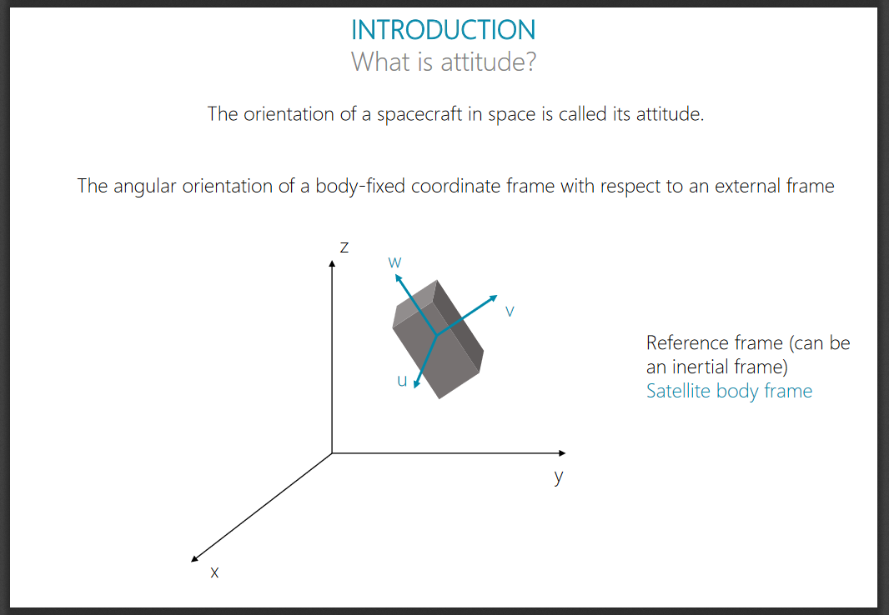
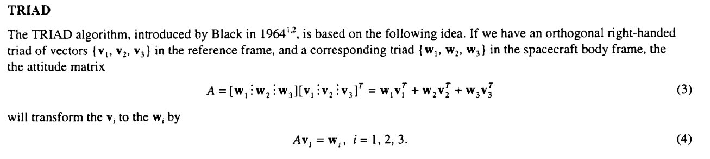
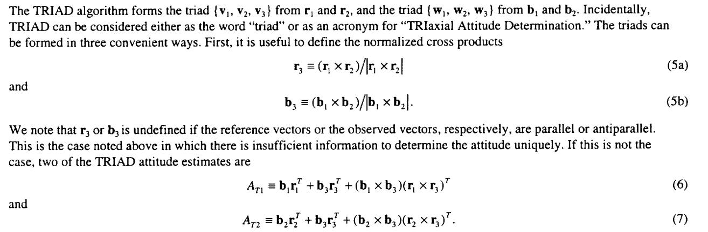

# Attitude Adjustment

## Astronomy, Astrophysics, Astrometry, Astrodynamics, AAAA

*69 points, 62 solves*
Our star tracker has collected a set of boresight reference vectors, and identified which stars in the catalog they correspond to. 

Active ADDVulcan players:

- arko
- Bun
- funsized
- Jigo
- Bashinerox
- amiedd
- alvaro
- schneider
- FreQi
- nOtty

# Challenge Description

Compare the included catalog and the identified boresight vectors to determine what our current attitude is.


Note: The catalog format is unit vector `(X,Y,Z)` in a celestial reference frame and the magnitude (relative brightness)

### Ticket

Present this ticket when connecting to the challenge:

```
ticket{charlie47226alpha:GDIXRN78-6xCK34RmdUj_8lTV5t9hxwHiny8skzTpU7h6mnKPmpqYZfmJGu0G2yn7Q}
```

Don't share your ticket with other teams.

### Connecting

Connect to the challenge on
```
attitude.satellitesabove.me:5012
```
Using netcat, you might run
```
nc attitude.satellitesabove.me 5012
```

### Files

You'll need these files to solve the challenge.

[Download Files](https://github.com/AmieDD/ADDVulcan/blob/master/Astronomy%20Astrophysics%20Astrometry%20Astrodynamics%20AAAA/Attitude%20Adjustment/test.txt)

### Solving

Your team's flag for this challenge will look something like flag{charlie47226alpha:___a bunch of unguessable stuff___} .

# Writeup by schneider

## Initial solution
We have a look at the star catalog in `test.txt` from the `Files` section of the challenge. It contains 2500 lines containing 4 numbers each:
```
0.07002547605232286,	0.11013923822791234,	0.9914463076265002,	549.9163822901205
-0.343541169379814,	0.8721600435864687,	0.34830492863638757,	549.8552449937595
[...]
```

From the description we know that each line contains a (unit) vector pointing towards a star as well as the stars magnitude. It is obvious that the magnitude is the last number and therefore the first three numbers are the vector in `(X,Y,Z)` format.

We connect to the server, provide our ticket and are presented with this list:
```
  ID : X,		Y,		Z
--------------------------------------------------
 280 : 0.031398,	0.364757,	0.930573
 356 : -0.068045,	0.271002,	0.960171
 491 : -0.154224,	0.403861,	0.901727
 551 : 0.033056,	0.387761,	0.921167
 632 : 0.042576,	0.227912,	0.972750
 724 : -0.093958,	0.209336,	0.973319
 810 : -0.065109,	0.213299,	0.974815
 868 : 0.017352,	0.233411,	0.972223
 927 : -0.129317,	0.289766,	0.948321
 975 : 0.129272,	0.403796,	0.905670
1016 : -0.129423,	0.266476,	0.955113
1113 : -0.122308,	0.390462,	0.912458
1212 : 0.064682,	0.262305,	0.962815
1378 : 0.044127,	0.216175,	0.975357
1452 : -0.011817,	0.388316,	0.921450
1604 : -0.149580,	0.263641,	0.952953
1649 : -0.115449,	0.462235,	0.879210
1816 : 0.075783,	0.259549,	0.962752
1913 : 0.140753,	0.393908,	0.908309
2005 : -0.001519,	0.385355,	0.922767
2206 : 0.045324,	0.361944,	0.931097
2452 : 0.133572,	0.341204,	0.930450
2489 : -0.126057,	0.291270,	0.948299
```
This list corresponds to a list of boresight vectors obtained from the image sensor of a star tracker.
From the header we can see that the observed vector is already matched to a star from the catalog. The
ID corresponds to a line inside `test.txt`.

We do a little bit of research on what the term *attitude* means in the context of satellites. The
following two PDFs are examined:
- [Attitude Determination and Control Systems](https://ntrs.nasa.gov/archive/nasa/casi.ntrs.nasa.gov/20110007876.pdf)
- [Attitude Determination And Control](http://www.s3l.be/usr/files/di/fi/2/Lecture13_ADCS_TjorvenDelabie_20181111202.pdf)

Given these and the fact that the interactive server connection demands 4 floats we assume that our
answer needs to be a [quaternion](http://www.chrobotics.com/library/understanding-quaternions)
describing the satellites attitude (aka rotation) in space.


We start to think how to get from these lists of vectors to the attitude of the satellite.

An illustration of whats going on:



The vectors from the catalog correspond to stars in the ST reference frame. The observations from the
star tracker are from a rotated CT reference frame which represents the rotation (or attitude) of the
satellite. Note: Even though the origin of the reference frame of the satellite does not share its
origin with the reference frame of the catalog, the vectors match up due to the huge distance to the
observed stars.



This rotation can generally be described by a 3x3
[rotation matrix](https://en.wikipedia.org/wiki/Rotation_matrix). Such a matrix can be converted into
the required quaternion to solve the challenge.

But how to get to this matrix? Further literature research uncovers the following paper: [Attitude Determination Using Two Vector Measurements](https://ntrs.nasa.gov/archive/nasa/casi.ntrs.nasa.gov/19990052720.pdf). It details the `TRIAD` algorithm:



We start testing this solution in GNU Octave and arrive at our first rotation matrix `A`:
```
A =

  -0.064507   0.434417   1.173328
   0.032594  -0.147615  -0.364805
   0.176485  -0.927137  -2.492773
```

Inserting these values into a [rotation matrix converter](https://www.andre-gaschler.com/rotationconverter/)
leads to the corresponding quaternion `[ 0.9189114, 0.1200101, 0.346868, -0.1445064 ]`.

We submit this quaternion (formatted as `0.9189114, 0.1200101, 0.346868, -0.1445064`) to the challenge server. It seems to be happy and provides us with the following output:
```
19 Left...
  ID : X,		Y,		Z
--------------------------------------------------
  65 : -0.367363,	0.705034,	0.606606
 155 : -0.186866,	0.707777,	0.681273
 323 : -0.243631,	0.790303,	0.562196
 527 : -0.251155,	0.695226,	0.673485
1053 : -0.219390,	0.688227,	0.691529
1277 : -0.256230,	0.805457,	0.534402
1281 : -0.290766,	0.792222,	0.536507
1382 : -0.077165,	0.790505,	0.607575
1689 : -0.205899,	0.725303,	0.656918
1760 : -0.223416,	0.807664,	0.545678
1987 : -0.203897,	0.689828,	0.694668
2010 : -0.289710,	0.662184,	0.691072
2113 : -0.206758,	0.842539,	0.497372
2185 : -0.228392,	0.831302,	0.506729
```

We can see two things:
 - Apparently the solution is correct (even though we know from poking around that `1,0,0,0` is also an accepted solution for the first round).
 - We have to do this 19 more times.

Confident that our solution is correct, we start to automate the process and write a Python script which
automates parsing the input, calculating a solution and submitting it to the server. It can be found in `solution.py`.

Calculating the vectors and the rotation matrix `A` are straight forward. The `pyquaternion` library provides a class to work with quaternions. The class can be initialized with a rotation matrix but in our case it simply errors out with:
`ValueError: Matrix must be orthogonal, i.e. its transpose should be its inverse`. Obviously the calculated rotation matrix is not perfect and needs some kind of orthogonalization. All naive tries fail and we go back to the website we used originally to convert the rotation matrix into a quaternion. Somehow it must have done it!

Studying the websites source leads us to an implementation in [three.js](https://github.com/mrdoob/three.js/blob/dev/src/math/Quaternion.js#L319). We also discover a general description of the [problem](http://www.euclideanspace.com/maths/geometry/rotations/conversions/matrixToQuaternion/index.htm). Given these resources it is easy to construct a function which takes a rotation matrix and outputs the `x,y,z,w` components of a corresponding quaternion.

We supply the resulting quaternion to the challenge server but it is not happy and says `Invalid vector, Make sure to normalize`. Obviously some normalization is needed and thankfully the `Quaternion` class from `pyquaternion` offers such a function: `q = Quaternion(qw, qx, qy, qz).normalised`.

The server is now happy with the quaternion in general but our solution for the second round is not accepted. We start wondering what could be the cause. We ponder the following possibilities:
 - Maybe we have to average with the previous result.
 - Maybe we have to average multiple observations into a single vector.
 - Maybe we should try a different subset of vectors (currently we use the first three) from provided data.
 - Maybe the star catalog is not 0 indexed but 1 indexed.

Sadly none of these ideas lead anywhere and it looks like we are stuck.

We start investigating other solutions and the "Singular Value Decomposition (SVD) Method" described in [How to Estimate Attitude from Vector Observations](https://ntrs.nasa.gov/archive/nasa/casi.ntrs.nasa.gov/19990104598.pdf) seems to be suitable.

This solution takes multiple (at least two) pairs of vectors (`bi` from the observations and `ri` from the catalog),
combines them into a matrix `B`. It then uses
a [Singular Value Decomposition](https://en.wikipedia.org/wiki/Singular_value_decomposition) to calculate
the optimal rotation matrix `A` which translates between `bi` and `ri`. This solution has three advantages:
 - It can consume all provided observations. We don't need to worry about selecting a subset.
 - It can optionally incorporate a weight for each vector pair. We think that the stars magnitude might be a good candidate for that (assuming that brighter stars can be located more accurately).
 - It uses an SVD at its center which is directly accessible from Pythons `numpy` library.

We start to prototype a solution and end up with this at its core:
```Python
B = np.array([[0.,0.,0.],[0.,0.,0.],[0.,0.,0.]])
for obs in yArrays[:2]:
    star_id = obs[0]
    obs = np.array([float(f) for f in obs[1:]])
    star_data = xArrays[int(star_id)]
    star_loc = np.array([float(f) for f in star_data[:3]])
    star_mag = float(star_data[3])

    ai = star_mag
    bi = np.reshape(obs,(-1, 3))
    ri = np.reshape(star_loc,(-1, 3))
    print(f"Observed star {star_id} at {bi}. Catalog vector: {ri}");

    B += ai * bi * ri.T

u, s, vh = np.linalg.svd(B, full_matrices=True)
C = [[1, 0, 0], [0, 1, 0], [0, 0, np.linalg.det(u) * np.linalg.det(vh)]]
A = np.matmul(np.matmul(u, C), vh)

qx, qy, qz, qw = quat(A)
q = Quaternion(qw, qx, qy, qz).normalised
print(f"Attitude: (x:{q.x}, y:{q.y}, z:{q.z}, w:{q.w})")
```

To our delight this gets us past round 2. We quickly automate this into `solution.py` and soon after
the script runs through all rounds and we get rewarded with a flag:
```
======== Receiving 4096B ========
<< b'0 Left...'
<< b'flag{charlie47226alpha:GCuGt6vTlIJCKelLdCNp1yMUf1WVi7qtxEO1MWygfKxmPayMlLOgOQP0Yy783GsjtlYoy-TuyXNmT9aAa3Plv-g}'
<< b''
```

## Improved solution

After finishing the CtF we had another look at our solution to this problem. While the SVD based approach worked, we were still wondering why the `TRIAD` algorithm did not work. We were also wondering if the special conversion from the rotation matrix to the quaternion and the normalization of the resulting quaternion were still needed.

### TRIAD
After reading the paper explaining the `TRIAD` algorithm again it became clear that we were missing a crucial step before creating the two triads of vectors. The paper details how to pick two sets of two vectors and then use these sets to generate two new sets of three vectors each. These new sets can then be used to perform the computation:



Implemented in Python our working `TRIAD` implementation looks like this (see `solution_improved.py`):

```Python
obs1 = np.array([float(f) for f in observations[0][1:]])
obs2 = np.array([float(f) for f in observations[1][1:]])

star_id1 = observations[0][0]
star_id2 = observations[1][0]

star_data1 = catalog[int(star_id1)]
star_data2 = catalog[int(star_id2)]

star_loc1 = np.array([float(f) for f in star_data1[:3]])
star_loc2 = np.array([float(f) for f in star_data2[:3]])

b1 = np.reshape(obs1,(-1, 3))
b2 = np.reshape(obs2,(-1, 3))
b3 = np.cross(b1, b2) / np.linalg.norm(np.cross(b1, b2))
r1 = np.reshape(star_loc1,(-1, 3))
r2 = np.reshape(star_loc2,(-1, 3))
r3 = np.cross(r1, r2) / np.linalg.norm(np.cross(r1, r2))

A = b1*r1.T + b3*r3.T + np.cross(b1, b3) * np.cross(r1, r3).T

qx, qy, qz, qw = quat(A)
q = Quaternion(qw, qx, qy, qz).normalised
```

### SVD
Poking around some more we realized that:
 - The SVD produces an orthogonal rotation matrix which can be directly used (`q = Quaternion(matrix=A)`).
 - The resulting quaternion is already normalized (no need to use `q.normalised`).
 - The stars magnitude can be ignored.
 - Python3 has a much nicer notation for matrix multiplication.
 - numpy offers some nice helper functions to create the used matrices.
 - scipy offers a way to convert from a rotation matrix to a quaternion.

This lead to our cleaned up solution (found as well in `solution_improved.py`):
```Python
from scipy.spatial.transform import Rotation as R

B = np.zeros((3,3))
# First two observations are actually enough
for obs in observations:
    star_id = obs[0]
    obs = np.array([float(f) for f in obs[1:]])
    star_data = catalog[int(star_id)]
    star_loc = np.array([float(f) for f in star_data[:3]])
    star_mag = float(star_data[3])

    ai = star_mag
    bi = np.reshape(obs,(-1, 3))
    ri = np.reshape(star_loc,(-1, 3))
    print(f"Observed star {star_id} at {bi}. Catalog vector: {ri}");

    B += ai * bi * ri.T

u, s, vh = np.linalg.svd(B, full_matrices=True)
C = np.diag([1, 1, np.linalg.det(u) * np.linalg.det(vh)])
A = u @ C @ vh

q = R.from_matrix(A).as_quat()
print(f"Attitude: (x:{q[0]}, y:{q[1]}, z:{q[2]}, w:{q[3]})")
```

# Additional resources

 - [A Tutorial on Vectors and Attitude](http://www.malcolmdshuster.com/Pubp_018_073y_J_CSM_Vecs%26Att_MDS.pdf)
