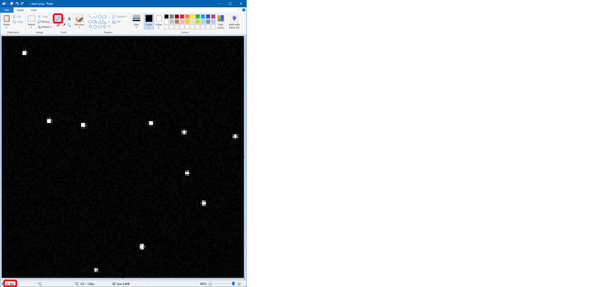
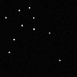
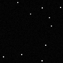
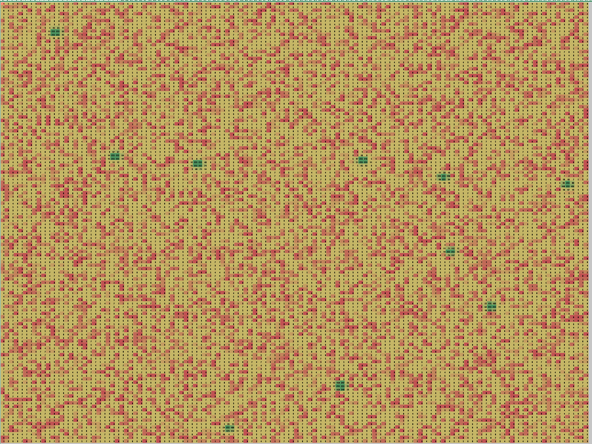
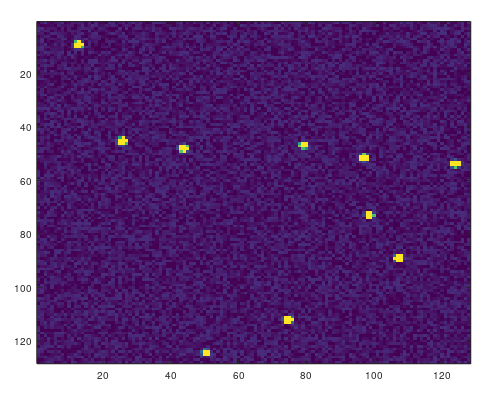

# Seeing Stars
## Astronomy, Astrophysics, Astrometry, Astrodynamics, AAAA

*23 points, 213 solves*

Active ADDVulcan players:
- alvarop
- amiedd
- carfucar
- kandi3kan3
- m_w
- supersat
- WireGhoul
- worm

# Challenge Description

Here is the output from a CCD Camera from a star tracker,
identify as many stars as you can! (in image reference coordinates)
Note: The camera prints pixels in the following order (x,y):
(0,0), (1,0), (2,0)... (0,1), (1,1), (2,1)...

Note that top left corner is (0,0).

## Ticket

Present this ticket when connecting to the challenge:
```
ticket{victor624juliet:GLokOngLOluXVb4dQizz9cmvj8s-3UVmrjWWG0sb8v19OKnXs8ZCc4El6KqEDs8byQ}
```

Don't share your ticket with other teams. 

## Connecting

Connect to the challenge on 
```
stars.satellitesabove.me:5013
```
Using netcat, you might run 
```
nc stars.satellitesabove.me 5013
```

## Solving

Your team's flag for this challenge will look something like
```
flag{victor624juliet:___a bunch of unguessable stuff___}
```

# Writeup by kandi3kan3

Connecting to the server with netcat prints out a long list of numbers,
then asks us for input. After about 10 seconds, the server disconnects us.

```
[kan3 ~]$ nc stars.satellitesabove.me 5013
Ticket please:
ticket{victor624juliet:GLokOngLOluXVb4dQizz9cmvj8s-3UVmrjWWG0sb8v19OKnXs8ZCc4El6KqEDs8byQ}
1,5,9,3,2,4,6,9,1,3,7,5,6,6,2,7,1,8,2,2,1,8,8,2,5,7,2,6,9,5,8,3,1,2,8,8,8,7,1,1,0,6,8,1,5,2,7,4,5,1,9,1,5,6,3,6,1,5,0,5,0,1,4,0,9,2,8,3,6,3,1,0,9,5,6,7,7,8,4,1,9,7,2,5,4,4,4,6,9,3,7,8,5,2,6,6,4,4,6,5,1,0,8,2,2,4,4,8,4,8,8,2,5,3,0,9,5,4,7,1,1,9,2,1,5,8,1,8
3,1,2,2,3,0,7,4,4,5,6,0,4,9,2,5,9,8,3,4,6,5,8,5,0,5,7,5,0,7,6,1,4,3,6,1,1,3,4,4,1,4,6,3,3,3,0,0,6,4,1,3,9,1,3,7,5,3,0,2,9,7,3,6,7,7,9,9,9,5,6,9,2,6,2,5,7,9,0,2,2,4,1,7,0,6,8,2,0,2,1,2,8,7,4,2,4,5,6,4,8,2,4,1,8,8,3,5,6,4,8,3,0,5,6,7,9,8,5,2,9,2,2,7,4,8,1,4
<...126 more lines of data...>

Enter your answers, one 'x,y' pair per line.
(Finish your list of answers with an empty line)
Timeout, Bye
```

All of the numbers are within the range [0, 255], so I went ahead and
guessed that these were 8-bit values.
I loaded the data into Python as a 2D list:

```python
data = [
[1,5,9,3,2,4,6,9...],
[3,1,2,2,3,0,7,4...],
...
]
```

It looked like the dimensions of the image data were 128x128, which led
me to believe that the image was greyscale - there wouldn't be a whole
lot of resolution if it were anything else.

I used [`pillow`](https://pillow.readthedocs.io/en/stable/) to load the
data in as an 8 bit-per-pixel (8bpp) greyscale image and write it back
out as a PNG:

```python
from PIL import Image

# flatten the data into a byte string
flattened = bytes([pixel for row in data for pixel in row])

# parse the data as a 128x128 image, 8bpp greyscale ('L' mode)
image = Image.frombytes('L', (128, 128), flattened)
image.save('stars1.png', 'PNG')
```

This gave me a very nice looking set of stars!
This image isn't *quite* correct, but as we'll see shortly, that's alright.


The problem is asking us to identify localized centers of brightness.
Before writing code to do that, I checked if I was on the right track by
manually grabbing the coordinates of the stars in the highly advanced tool
known as Microsoft Paint:



It turns out Paint uses the same coordinate scheme described by the
problem, with pixel (0, 0) in the top-left. All I had to do was hover
over each star with the pixel tool and record the values:

```
12,8
25,44
43,47
78,46
96,50
123,53
98,72
106,88
74,111
49,123
```

(I'd like to mention supersat here, as he'd already gotten and tested
these values a few minutes before I got around to it).

I went to send the values to the server, and...

```
[kan3 ~]$ nc stars.satellitesabove.me 5013
Ticket please:
ticket{victor624juliet:GLokOngLOluXVb4dQizz9cmvj8s-3UVmrjWWG0sb8v19OKnXs8ZCc4El6KqEDs8byQ}
1,5,9,3,2,4,6,9,1,3,7,5,6,6,2,7,1,8,2,2,1,8,8,2,5,7,2,6,9,5,8,3,1,2,8,8,8,7,1,1,0,6,8,1,5,2,7,4,5,1,9,1,5,6,3,6,1,5,0,5,0,1,4,0,9,2,8,3,6,3,1,0,9,5,6,7,7,8,4,1,9,7,2,5,4,4,4,6,9,3,7,8,5,2,6,6,4,4,6,5,1,0,8,2,2,4,4,8,4,8,8,2,5,3,0,9,5,4,7,1,1,9,2,1,5,8,1,8
<...127 more lines of data...>

Enter your answers, one 'x,y' pair per line.
(Finish your list of answers with an empty line)
ticket{victor624juliet:GLokOngLOluXVb4dQizz9cmvj8s-3UVmrjWWG0sb8v19OKnXs8ZCc4El6KqEDs8byQ}
12,8
25,44
43,47
78,46
96,50
123,53
98,72
106,88
74,111
49,123

Failed...
```

Hmm. I went back to read the problem description, and I guessed that I had
the X and Y coordinates flipped. Rather than updating my code to handle
this correctly, I decided to flip the coordinates of my answers instead:

```
[kan3 ~]$ nc stars.satellitesabove.me 5013
Ticket please:
ticket{victor624juliet:GLokOngLOluXVb4dQizz9cmvj8s-3UVmrjWWG0sb8v19OKnXs8ZCc4El6KqEDs8byQ}
1,5,9,3,2,4,6,9,1,3,7,5,6,6,2,7,1,8,2,2,1,8,8,2,5,7,2,6,9,5,8,3,1,2,8,8,8,7,1,1,0,6,8,1,5,2,7,4,5,1,9,1,5,6,3,6,1,5,0,5,0,1,4,0,9,2,8,3,6,3,1,0,9,5,6,7,7,8,4,1,9,7,2,5,4,4,4,6,9,3,7,8,5,2,6,6,4,4,6,5,1,0,8,2,2,4,4,8,4,8,8,2,5,3,0,9,5,4,7,1,1,9,2,1,5,8,1,8
<...127 more lines of data...>

Enter your answers, one 'x,y' pair per line.
(Finish your list of answers with an empty line)
8,12
44,25
47,43
46,78
49,96
53,123
72,98
88,106
111,74
123,49

4 Left...
6,9,8,4,2,6,8,0,4,1,9,7,0,4,5,1,3,2,6,1,7,5,0,1,1,3,8,2,3,1,9,7,3,6,2,4,5,4,7,7,9,2,4,2,3,6,0,0,7,7,5,5,9,4,0,7,9,3,4,5,5,7,7,1,3,9,1,3,5,7,8,6,5,7,3,9,1,3,1,8,4,5,2,4,5,7,7,5,5,3,5,8,2,2,2,2,8,6,4,9,0,9,0,1,8,8,9,6,8,7,4,5,5,9,4,5,2,1,8,0,6,1,4,5,8,7,1,6
<...127 more lines of data...>

Enter your answers, one 'x,y' pair per line.
(Finish your list of answers with an empty line)
```


Success! At this point, I was ready to start writing some code to automate
this, but I noticed that text above the image data: "4 Left...".

Looking at the data I got, I noticed that it was 128x128 again.
I repeated my steps to get the second image, which again had 10 stars -
still easy enough to do by hand. And so I did:

```
[kan3 ~]$ nc stars.satellitesabove.me 5013
Ticket please:
ticket{victor624juliet:GLokOngLOluXVb4dQizz9cmvj8s-3UVmrjWWG0sb8v19OKnXs8ZCc4El6KqEDs8byQ}
1,5,9,3,2,4,6,9,1,3,7,5,6,6,2,7,1,8,2,2,1,8,8,2,5,7,2,6,9,5,8,3,1,2,8,8,8,7,1,1,0,6,8,1,5,2,7,4,5,1,9,1,5,6,3,6,1,5,0,5,0,1,4,0,9,2,8,3,6,3,1,0,9,5,6,7,7,8,4,1,9,7,2,5,4,4,4,6,9,3,7,8,5,2,6,6,4,4,6,5,1,0,8,2,2,4,4,8,4,8,8,2,5,3,0,9,5,4,7,1,1,9,2,1,5,8,1,8
<...127 more lines of data...>

Enter your answers, one 'x,y' pair per line.
(Finish your list of answers with an empty line)
8,12
44,25
47,43
46,78
49,96
53,123
72,98
88,106
111,74
123,49

4 Left...
6,9,8,4,2,6,8,0,4,1,9,7,0,4,5,1,3,2,6,1,7,5,0,1,1,3,8,2,3,1,9,7,3,6,2,4,5,4,7,7,9,2,4,2,3,6,0,0,7,7,5,5,9,4,0,7,9,3,4,5,5,7,7,1,3,9,1,3,5,7,8,6,5,7,3,9,1,3,1,8,4,5,2,4,5,7,7,5,5,3,5,8,2,2,2,2,8,6,4,9,0,9,0,1,8,8,9,6,8,7,4,5,5,9,4,5,2,1,8,0,6,1,4,5,8,7,1,6
<...127 more lines of data...>

Enter your answers, one 'x,y' pair per line.
(Finish your list of answers with an empty line)
12,90
31,41
42,88
44,60
69,48
78,90
77,110
88,45
98,29
117,60

3 Left...
4,8,9,1,7,5,9,1,5,5,5,5,6,0,0,5,3,2,6,0,3,8,9,5,5,7,5,1,0,7,9,5,3,6,9,0,4,6,8,4,2,9,7,6,6,1,8,2,9,0,3,0,2,1,0,6,8,4,3,5,0,5,3,5,0,4,0,3,2,5,0,0,0,3,1,9,7,6,9,7,7,4,0,2,1,1,4,5,3,8,1,6,6,6,5,1,9,9,3,2,9,3,1,4,6,9,2,7,2,6,9,9,4,2,1,6,6,7,1,0,1,8,9,5,8,6,6,0
<...127 more lines of data...>

Enter your answers, one 'x,y' pair per line.
(Finish your list of answers with an empty line)
```


Nice! That got me another image, again 128x128 with 10 stars.
I decided to keep going with the manual approach, which was working so far.
I was fully expecting the last image to be enormous or have a large
number of stars - most CTFs I've played in with this style of problem
tend to increase in difficulty or randomize the data to make it impossible
to solve the problem without automation.

But I never ran into a problem.

And after a few minutes, I had a solution I could just paste into the
netcat session:

```
ticket{victor624juliet:GLokOngLOluXVb4dQizz9cmvj8s-3UVmrjWWG0sb8v19OKnXs8ZCc4El6KqEDs8byQ} 

8,12
44,25
47,43
46,78
49,96
53,123
72,98
88,106
111,74
123,49

12,90
31,41
42,88
44,60
69,48
78,90
77,110
88,45
98,29
117,60

27,51
49,29
64,6
66,76
79,42
82,113
95,36
97,87
102,104
113,36

13,49
17,32
29,9
29,56
42,36
48,56
55,82
65,23
87,15
100,99

5,36
16,85
15,123
28,62
35,100
52,104
91,92
110,44
115,7
123,85

```

And with that, I got my reward:

```
flag{victor624juliet:GE5w5S6CQbhnN-vzkxQ7IHWrAYpul9YLS-k0XEBZOtK6gKqJnr2n0HNlq2xHtHB4ocmAyKGwDLyrUKjj3LwVDGk}
```

I think we've earned a nice break to just sit back and look at the stars:





I've included some [really bad Python code](./seeing-stars.py)
where I copy-pasted the data for all of the images to generate PNGs.

## Alternative Approaches

Some of my teammates were trying tools I wouldn't have thought to use for
this challenge, and I think it's worthwhile to mention their approaches:

- carfucar loaded the data into Excel and applied conditional formatting.
  I think that this would have worked really well for the manual approach
  I took, and the data is already formatted as a CSV to import it.

  

- alvarop loaded the data into GNU Octave:

  
