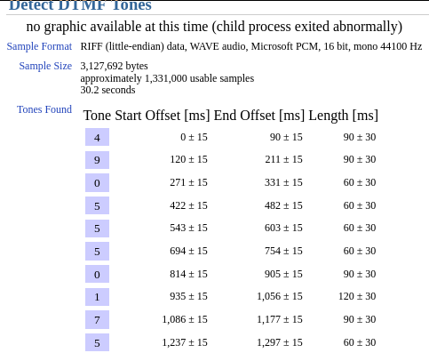
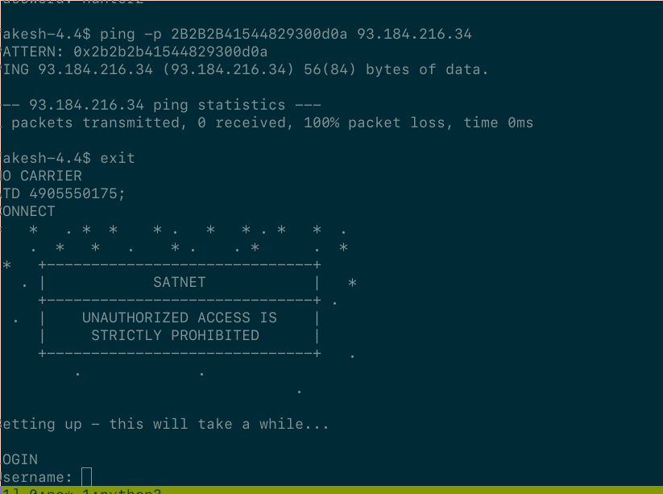
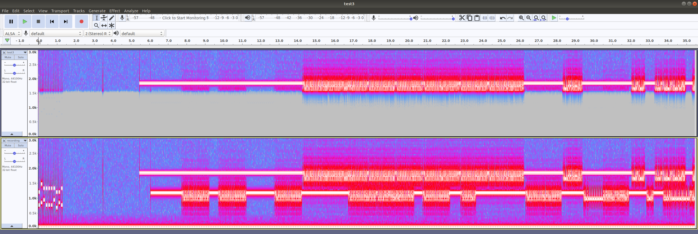
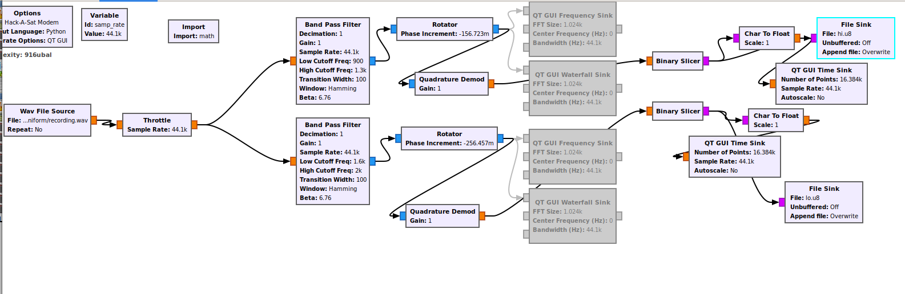
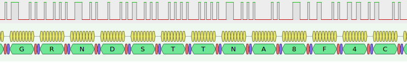
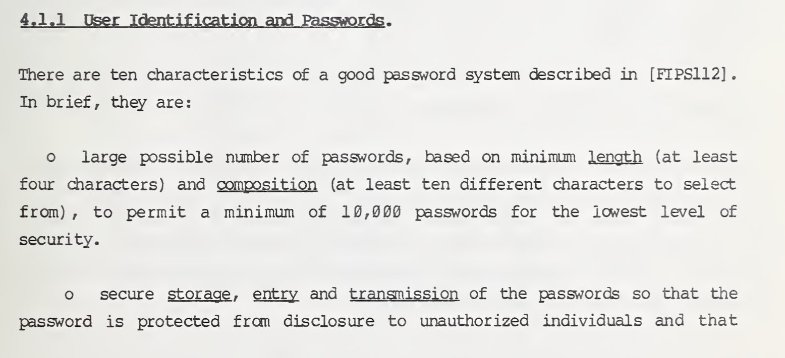
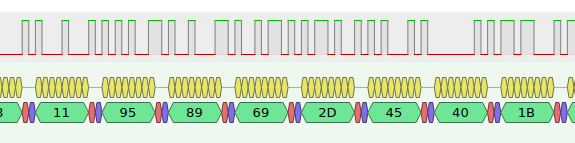

# 56K Flex Magic

## Communication Systems

*205 points, 13 solves*

Active ADDVulcan players:

- alvarop
- cellphonedude
- dtechshield
- esden
- FreQI
- kandi3kan3
- lennert
- miek
- schneider
- sharebrained
- supersat
- WillC
- worm

# Challenge Description

Anyone out there speak modem anymore? We were able to listen in to on, maybe you can ask it for a flag…

UPDATE: Since everyone is asking, yes...a BUSY signal when dialing the ground station is expected behavior.

## Ticket

Present this ticket when connecting to the challenge:
`ticket{sierra38145uniform:GIyhZYSF1Abcaajl_zWecs6d2n8GQ52t2AK3dKOhsZuqRDGNC_gdchzA_LoRn1w1PQ}`

Don't share your ticket with other teams.

## Connecting

Connect to the challenge on `modem.satellitesabove.me:5052`. Using netcat, you might run `nc modem.satellitesabove.me 5052`

## Solving

Your team's flag for this challenge will look something like `flag{sierra38145uniform:___a bunch of unguessable stuff___}`. 

# Writeup by sharebrained

We connect to the server and provide our ticket. We get a Linux-ish serial port.

```
Ticket please:
ticket{sierra38145uniform:GIyhZYSF1Abcaajl_zWecs6d2n8GQ52t2AK3dKOhsZuqRDGNC_gdchzA_LoRn1w1PQ}
Connected to /dev/ttyACM0
```

The challenge description and [my_note.txt](files/my_note.txt) indicates we're dealing with dial-up modems, so we use the phone number and credentials to dial out to the first server via the serial port:

```
ATD 2825550194;
CONNECT
 _     _____ _____ _____ _   _ 
| |   |  _  |  __ \_   _| \ | |
| |   | | | | |  \/ | | |  \| |
| |   | | | | | __  | | | . ` |
| |___\ \_/ / |_\ \_| |_| |\  |
\_____/\___/ \____/\___/\_| \_/

Username: hax
Password: hunter2

fakesh-4.4$ ls
ls
ping
exit
fakesh-4.4$
```

Hmmm, our options are quite limited.

Meanwhile, we examine the [recording](files/recording.wav). It contains audio of a dial-up modem session, including the dial-out phase. We recover the dialed digits `4905550175` from the [DTMF](https://en.wikipedia.org/wiki/Dual-tone_multi-frequency_signaling) tones, using an [online DTMF decoder](http://dialabc.com/sound/detect/).



We try dialing the number through the serial port, and get a `BUSY` signal. The second system is actively connected. How do we get it to hang up and answer a call from us?

[my_note.txt](files/my_note.txt) suggests we can use a [ping-of-death](https://en.wikipedia.org/wiki/Ping_of_death) from the first server, with a payload of `+++ATH0`, to cause a disconnection at the second server.



Now we need credentials for the second system. Perhaps they can be found in the modem [recording](files/recording.wav)? We look at the spectrograph of the recording, and see strong evidence we're dealing with a 300 baud modem signal, either [Bell 103](https://en.wikipedia.org/wiki/Bell_103_modem) or [ITU-T Recommendation V.21](https://www.itu.int/rec/T-REC-V.21/en).



We try [minimodem](https://github.com/kamalmostafa/minimodem), [inspectrum](https://github.com/miek/inspectrum) + [Python](https://www.python.org/), and [GNU Radio](https://www.gnuradio.org/) + [PulseView](https://sigrok.org/wiki/PulseView) as different ways of obtaining the demodulated data for both sides of the conversation.

minimodem works well, to a point, but has trouble producing reliable data. We spend a lot of time filtering the audio to improve the decodes. We do find some interesting text within the conversation: `GRNDSTTNA8F6C` and `rocketman6888`.

```
$ minimodem -r -f test3.wav -a 300
### NOCARRIER ndata=359 confidence=1.987 ampl=0.122 bps=300.00 (rate perfect) ###
### CARRIER 300 @ 1850.0 Hz ###
|�#��i-E@GRNDSTTNA8F6C�j~
```

```
�#C1i,Aw{6�(+����B��}^��ٜrocketman6888�~
```

The combination of inspectrum (to produce a frequency-vs-time file) and Python to slice it into bits also recovers the `GRNDSTTNA8F6C`.

```
$ python3 decodebits.py
~Â#•‰i-E@GRNDSTTNA8F6Cðj
```

The GNU Radio approach is similarly dicey. Using carrier frequency measurements made from a spectrogram view, we construct a [flow graph](gnuradio/modem.grc) that filters and separates the two frequency bands (one for each direction of the modem conversation). These two bands were transformed into two frequency-vs-time outputs that were centered on 0 Hz. Those frequency outputs are sliced into bits and output to two files -- [hi.u8](gnuradio/hi.u8) and [lo.u8](gnuradio/lo.u8).



Those bits, which resemble the output of a logic analyzer capture of a [UART](https://en.wikipedia.org/wiki/Universal_asynchronous_receiver-transmitter), are fed into PulseView, which has a [UART protocol decoder](https://sigrok.org/wiki/Protocol_decoder:Uart). Strings that were recovered using other techniques were plainly visible, despite the occasional UART framing error.



We try to log in to the second system with many variations of the strings we found. No luck.

Reviewing [my_note.txt](files/my_note.txt), we see that the password is likely numeric, and complies with the minimum requirements of [FIPS-112 (Password Usage)](https://nvlpubs.nist.gov/nistpubs/Legacy/FIPS/fipspub112.pdf) and [NBS Special Publication 500-137](https://nvlpubs.nist.gov/nistpubs/Legacy/SP/nbsspecialpublication500-137.pdf) (section 4.1.1).



How do these hints reconcile with the strings we found in the modem conversation, which are definitely not four-digit numeric PINs?

In the demodulated modem conversation, we notice something resembling [HDLC](https://en.wikipedia.org/wiki/High-Level_Data_Link_Control), with 0x7e flag bytes at the start and end of each modem burst. We also observe a lot of `}` characters, which reminds us of [PPP](https://en.wikipedia.org/wiki/Point-to-Point_Protocol). These two observations are consistent, since PPP is built atop HDLC.

Operating under the PPP assumption, we [transform](python/hdlc.py) the [modem conversation bytes](conversation.txt) into a hex dump which can be imported into [Wireshark](https://www.wireshark.org/). A [.pcapng file](modem_0.pcapng) is saved and shared with the team.

Wireshark fails to decode packets in one direction, which is interesting... We're also concerned about how some of the HDLC messages don't use 0x7e for some of the flags, but 0x7c. Perhaps the decoded modem bits are sketchy?

We explore the PPP avenue. Wireshark tells us we're looking at a combination of PPP, [LCP](https://en.wikipedia.org/wiki/Link_Control_Protocol), and a flavor of [CHAP](https://en.wikipedia.org/wiki/Challenge-Handshake_Authentication_Protocol) -- [MS-CHAP](https://en.wikipedia.org/wiki/MS-CHAP)?. We pull out the challenge and response portions of the message.

```
11 95 09 49 2d 45 40 1b 
GRNDSTTNA8F4C

00 00 00 00 00 00 00 00 00 00 00 00 00 00 00 00
00 00 00 00 00 00 00 00 69 2c 41 06 77 7b 13 36
d3 28 2b b5 a2 89 8b 42 01 9a e8 7e e5 c4 d9 9c
01
rocketman6888
```

A Python program is written to test all 10,000 PIN possibilities, using our extracted challenge and the candidate PIN as the password. [pymschap](https://github.com/talkincode/pymschap) is used to do the dirty MS-CHAP work. We should find a hash that starts with the value of the response we extracted.

```python
import binascii
from pymschap import mschap

chal = b'\x11\x95\x09\x49\x2d\x45\x40\x1b'

def tryPin(pin):
  print(pin, binascii.hexlify(mschap.generate_nt_response_mschap(chal, pin)))

for i in range(10000):
  tryPin('%04d' % i)
```

Unfortunately, it doesn't work! But due to our concerns about the accuracy of the data we demodulated, we are already at work improving quality of the demodulated data. It turns out the GNU Radio modem wasn't tuned to the correct frequencies for [ITU-T Recommendation V.21](https://www.itu.int/rec/T-REC-V.21/en), and there were numerous bit errors in one side of the conversation. Instead of going through the entire process from GNU Radio through Wireshark, we locate the portion of the PulseView decode that closely matches the incorrect challenge. It's different by a few bits, which is a good sign.



Rerunning the Python PIN tester with the cleaned-up challenge data, we locate a PIN that gives us the expected response: `5651`.

```
...
5651 b'692c4106777b1336c393282bc2b5c2a2c289c28b4201c29ac3a87ec3a5c384c399c29c'
...
```

We log in to the second server again, and get our flag!

```
satnet> flag
flag{sierra38145uniform:GCMJiwuYo4te1I6e3zXExgQXmgQVpeWVBz_Sq8bmS5EJxPZMHVxJCpDjIClw_mV5WLotPUoE6Tguk9Ow219xBig}
satnet>
```
