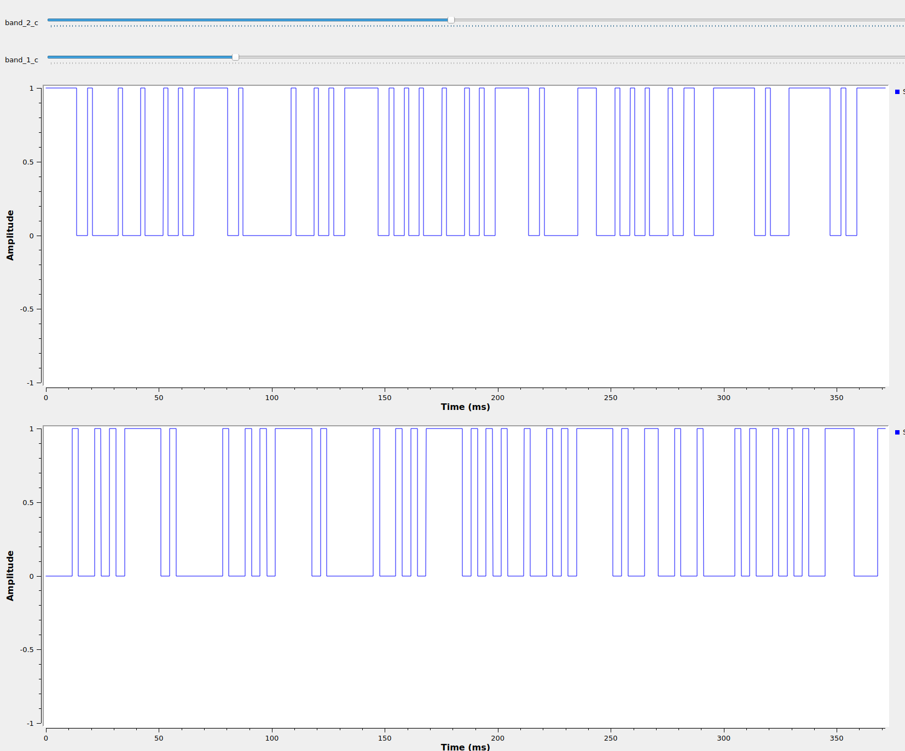
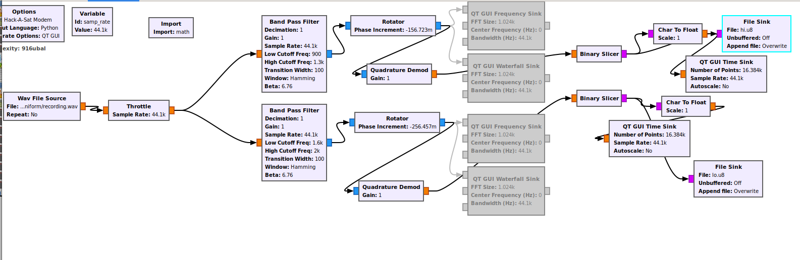
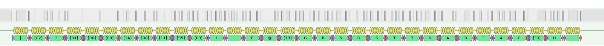
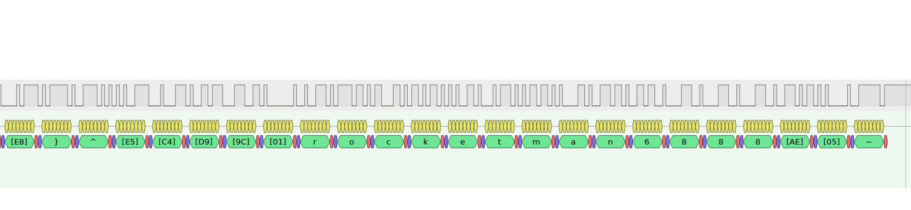
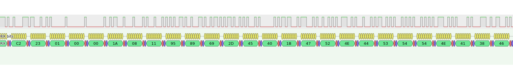

# 56K Flex Magic

## Description

This challenge involved demodulating a signal in a .wav file to obtain the flag.

Events are reconstructed from a Discord chat and personal files.

## Participants

@alvarop
@cellphonedude
@dtechshield
@esden
@FreQI
@kandi3kan3
@lennert
@miek
@schneider
@sharebrained
@supersat
@WillC
@worm

## Exploring the Server

```
nc modem.satellitesabove.me 5052
```

@alvarop observed the server responding to the [Hayes command set](https://en.wikipedia.org/wiki/Hayes_command_set).

@miek got a login prompt:

```
ATD 2825550194;
CONNECT
 _     _____ _____ _____ _   _ 
| |   |  _  |  __ \_   _| \ | |
| |   | | | | |  \/ | | |  \| |
| |   | | | | | __  | | | . ` |
| |___\ \_/ / |_\ \_| |_| |\  |
\_____/\___/ \____/\___/\_| \_/

Username: hax
Password: hunter2

fakesh-4.4$ ls
ls
ping
exit
fakesh-4.4$
```

@dtechshield located a [dial-up security control measures document](images/unknown.png) referencing [FIPS-112 (Password Usage)](https://nvlpubs.nist.gov/nistpubs/Legacy/FIPS/fipspub112.pdf), highlighting section 4.1.

@miek did some Ping of Death business. Others attempted to connecto to one of the numbers. (@sharebrained: "I'm really unclear what's going on here... I didn't come in until later.")

@lennert sent `+++ATH` and variations via ping.

```
fakesh-4.4$ ping -p 2B2B2B41544829 93.184.216.34
PATTERN: 0x2b2b2b41544829
PING 93.184.216.34 (93.184.216.34) 56(84) bytes of data.
64 bytes from 93.184.216.34: icmp_seq=1 ttl=44 time=8.84 ms

--- 93.184.216.34 ping statistics ---
1 packets transmitted, 1 received, 0% packet loss, time 0ms
rtt min/avg/max/mdev = 8.842/8.842/8.842/0.000 ms
```

@alvarop had [some sort of successful login](images/2020-05-23_122222.png).

@miek was able to dial out after exiting the login prompt he found earlier(?).

```
fakesh-4.4$ exit
NO CARRIER
ATD 4905550175;
CONNECT
*   *   . *  *    * .   *   * . *   *  .  
    .  *   *   .    * .    . *      .  *  
 *   +------------------------------+     
   . |            SATNET            |   * 
```

@lennert located a password policy indicating we were looking for a four-character numeric PIN.

```
 Their official password policy: minimum requirements of
  FIPS112 (probably just numeric)
    * TL;DR - section 4.1.1 of 'NBS Special Publication 500-137'
```

## Decoding Audio and Recovering the PIN

The [audio file](recording.wav) sounded like a phone call using [tone dialing](https://en.wikipedia.org/wiki/Dual-tone_multi-frequency_signaling), followed by a modem conversation.

@miek [examined the tone dialing]()(images/dtmf.png) (in [Inspectrum](https://github.com/miek/inspectrum)?) and @alvarop [decoded the tone dialing](images/2020-05-23_120237.png) (using what tool?) to `4905550175`.

@supersat was confident the audio was a 300 baud FSK variant. (...and posted an image of his ATA or SIP registration being unhappy?)

@miek attempted to decode the modem audio using inspectrum.

```
0011111101001000011101100010010110000001000000000100000000011001000001001111000100110011110011111101001111110100000001110100101001010000000101000000010000000001001100000101000000010010000001001100101100011011110011111101
```

@WillC attempted to demodulate the modem audio using [minimodem](https://github.com/kamalmostafa/minimodem).

A lot of effort went into trying to filter the modem audio. (Did anyone have a particular reason for doing this?)

@kandi3kan3 observed that the modulation frequencies in the audio file were not [Bell 103](https://en.wikipedia.org/wiki/Bell_103_modem).

@supersat thought the modem type was [ITU-T V.21](https://www.itu.int/rec/T-REC-V.21/en).

@sharebrained tried playing the recording into a [Commodore SX-64](https://en.wikipedia.org/wiki/Commodore_SX-64) running the CCGMS terminal program and a Commodore 1670 modem (300/1200 baud), via a phone attached to either the phone or line ports on the modem. That didn't work, probably due to a lack of [off-hook voltage](https://en.wikipedia.org/wiki/On-_and_off-hook) from the modem. @sharebrained tried making a call through a VoIP ATA to his mobile phone, but got voice mail because the VoIP account's caller ID was the same as the cell phone number. So he called his wife's phone, playing the audio through her phone back into the modem. Nothing. He gave up on this line of attack.

@lennert found some plaintext using `minimodem` with the `-a` option.

```
$ minimodem -r -f test3.wav -a 300
### NOCARRIER ndata=359 confidence=1.987 ampl=0.122 bps=300.00 (rate perfect) ###
### CARRIER 300 @ 1850.0 Hz ###
|�#��i-E@GRNDSTTNA8F6C�j~
```

@miek was making progress getting plaintext from the audio using Python.

```
$ python3 decodebits.py                                                                                    
~Â#•‰i-E@GRNDSTTNA8F6Cðj
```

@alvarop attempted to guess username and password from the recovered plaintext, but with no luck.

@sharebrained assembled a [quick-and-dirty demodulator](sharebrained/modem_300_v21.grc) using [GNU Radio](https://www.gnuradio.org/). First, he had to figure out what frequencies each band was at. A flow graph was constructed to output to a GUI frequency sink to allow visual estimation of the center frequency of each band. Then two complex bandpass filters were added, one for the high tone and one for the low tone, along with GUI sliders to fine-tune the frequency bands. Rotators to translate the frequency of each filter's output down to 0 hz (DC), through the magic of complex numbers! A quadrature demodulator block after each filter gave an instantaneous frequency output value. The output would be proportional to the dominant detected frequency in the filtered band, and by translating it to DC, the output would be positive for frequencies above the center frequency, and negative below the center frequency. Then, a binary slicer block converted the positive or negative instantaneous frequency value into a 1 (input >= 0 Hz) or 0 (input < 0 Hz), and streamed that out to a file. The output files contained one byte per output bit, with the bit value in the least significant bit of the byte. The files ([lo.u8](gnuradio/lo.u8), [hi.u8](gnuradio/hi.u8)) were dumped into our Discord channel.




@sharebrained took the two GNU Radio demodulator output files (one for each direction of the modem conversation) and loaded them into [PulseView](https://sigrok.org/wiki/PulseView), which is logic analyzer software that includes many protocol decoders, including one for asynchronous serial (UART). He fiddled around with the start, stop, and parity bit settings and eventually got something that decoded bytes that contained strings people were finding via other methods ("GRNDSTTN" and "rocketman6888").



@lennart found `rocketman6888` in the demodulated audio.

```
�#C1i,Aw{6�(+����B��}^��ٜrocketman6888�~
```

@sharebrained was able to corroborate the `rocketman6888` in the PulseView UART output.



Various combinations of the recovered plaintext were tried as credentials, but to no success. Brute-forcing the PIN was entertained...

@sharebrained extracted the output of the UART decoders from PulseView. It turns out you can export it as a log file. First, he exported the whole mess, which included far more information than was necessary.

```
--- snip ---
1383671-1383818 UART: RX bits: 0
1383818-1383965 UART: RX bits: 0
1383965-1384112 UART: RX: Stop bit
1384110-1384257 UART: RX: Start bit
1384257-1384404 UART: RX bits: 0
1384257-1385433 UART: RX: r
1384404-1384551 UART: RX bits: 1
1384551-1384698 UART: RX bits: 0
1384698-1384845 UART: RX bits: 0
1384845-1384992 UART: RX bits: 1
1384992-1385139 UART: RX bits: 1
1385139-1385286 UART: RX bits: 1
1385286-1385433 UART: RX bits: 0
1385433-1385580 UART: RX: Stop bit
1385584-1385731 UART: RX: Start bit
1385731-1385878 UART: RX bits: 1
1385731-1386907 UART: RX: o
1385878-1386025 UART: RX bits: 1
1386025-1386172 UART: RX bits: 1
1386172-1386319 UART: RX bits: 1
1386319-1386466 UART: RX bits: 0
1386466-1386613 UART: RX bits: 1
1386613-1386760 UART: RX bits: 1
1386760-1386907 UART: RX bits: 0
1386907-1387054 UART: RX: Stop bit
1387054-1387201 UART: RX: Start bit
1387201-1387348 UART: RX bits: 1
1387201-1388377 UART: RX: c
1387348-1387495 UART: RX bits: 1
1387495-1387642 UART: RX bits: 0
1387642-1387789 UART: RX bits: 0
1387789-1387936 UART: RX bits: 0
1387936-1388083 UART: RX bits: 1
1388083-1388230 UART: RX bits: 1
1388230-1388377 UART: RX bits: 0
1388377-1388524 UART: RX: Stop bit
1388523-1388670 UART: RX: Start bit
1388670-1388817 UART: RX bits: 1
1388670-1389846 UART: RX: k
1388817-1388964 UART: RX bits: 1
1388964-1389111 UART: RX bits: 0
1389111-1389258 UART: RX bits: 1
1389258-1389405 UART: RX bits: 0
--- snip ---
```

@sharebrained wrote some Python to pull out just the decoded characters, making a couple of parsing mistakes in the process. (_Hot tip_: don't export characters from PulseView. Instead export as hex and sort it out in your script -- your parser can just expect two hex characters every time, instead of having to handle both a single character -- which might be whitespace -- or an escaped character formatted as "[xx]", where "xx" is a hex value.) The decodes were posted to the channel, and later amended them after discovering the parsing mistakes, which dropped some characters (notably 0x20, spaces) from the output.

```
--- snip ---
1383992-1384139 UART: RX: Stop bit
1384144-1384291 UART: RX: Start bit
1384291-1385467 UART: RX: 72
1385467-1385614 UART: RX: Stop bit
1385611-1385758 UART: RX: Start bit
1385758-1386934 UART: RX: 6F
1386934-1387081 UART: RX: Stop bit
1387082-1387229 UART: RX: Start bit
1387229-1388405 UART: RX: 63
1388405-1388552 UART: RX: Stop bit
1388551-1388698 UART: RX: Start bit
1388698-1389874 UART: RX: 6B
1389874-1390021 UART: RX: Stop bit
--- snip ---
```

@sharebrained observed there was some framing taking place. Each burst started and ended with either a "\~" (0x7e) or a "\|" (0x7c). One direction of the conversation was consistent in using "\~" only. The other had seemingly random use of either "\~" or "\|". Weird. He remembered this from some recent [HDLC](https://en.wikipedia.org/wiki/High-Level_Data_Link_Control) telecom and [AIS](https://en.wikipedia.org/wiki/Automatic_identification_system) dabbling. Messages start and end with 0x7e. But the 0x7c characters in the bursts from one direction were... confusing.

@miek was onboard with the data being HDLC. His recovered data was looking similar.

```
00000000  7e c3 82 23 01 00 00 1a  08 11 c2 95 c2 89 69 2d  |~..#..........i-|
00000010  45 40 1b 47 52 4e 44 53  54 54 4e 41 38 46 36 43  |E@.GRNDSTTNA8F6C|
00000020  c3 b0 6a 7e 0a                                    |..j~.|
00000025
```

@sharebrained edited together the [two sides of the conversation](conversation.txt) with timestamps observed from within PulseView and posted them to the Discord channel.

@schneider observed the many "}" characters and presciently thought of [PPP](https://en.wikipedia.org/wiki/Point-to-Point_Protocol), which is derived from HDLC. Further reading of the HDLC specification revealed that "}" is used as an escape code... @supersat observed a lot of other characteristics in the data that indicated PPP, so I think we were all sold at that point.

@kandi3kan3 also observed the weirdness with one conversation's direction using exclusively 0x7e framing and the other mixing 0x7c and 0x7e.

@supersat thought there might be some "bit slippage" in the decodes.

@sharebrained tried for a bit to do HDLC FCS (CRC) checking and also unescape the escape codes. But hey, [Wireshark](https://www.wireshark.org/) knows how to decode PPP, right? So he converted the bursts of data into a "hex dump" file that could be imported into Wireshark.

```
O:
0000: FF 7D 23 C0 21 7D 21 7D 20 7D 20 3B 7D 22 7D 26 7D 20 7D 20 7D 20 7D 20 7D 23 7D 25 C2 23 81 7D 25 7D 26 7D 24 A1 52 98 7D 27 7D 22 7D 28 7D 22 7D 2D 7D 23 7D 26 7D 31 7D 24 7D 26 4E 7D 33 7D 37 7D 21 6C C8 22 C4 3A 90 4B D7 99 68 9A 60 45 62 7D 32 68 7D 20 7D 20 7D 20 7D 20 7D 37 7D 24 7D 20 7D 25 7D 38 A5
0000: FF 7D 23 C0 21 7D 22 7D 22 7D 20 7D 34 7D 22 7D 26 7D 20 7D 20 7D 20 7D 20 7D 25 7D 26 28 E5 4C 21 7D 27 7D 22 7D 28 7D 22 89 D4
0000: FF 7D 23 C0 21 7D 22 7D 23 7D 20 7D 34 7D 22 7D 26 7D 20 7D 20 7D 20 7D 20 7D 25 7D 26 28 E5 4C 21 7D 27 7D 22 7D 28 7D 22 C0 47
0000: FF 7D 23 C0 21 7D 21 7D 21 7D 20 7D 3C 7D 22 7D 26 7D 20 7D 20 7D 20 7D 20 7D 23 7D 25 C2 23 81 7D 25 7D 26 7D 24 A1 52 98 7D 27 7D 22 7D 28 7D 22 7D 2D 7D 23 7D 26 BF E4
0000: FF 7D 23 C0 21 7D 22 7D 24 7D 20 7D 34 7D 22 7D 26 7D 20 7D 20 7D 20 7D 20 7D 25 7D 26 28 E5 4C 21 7D 27 7D 22 7D 28 7D 22 7D 2C A7
0000: FF 7D 23 C0 21 7D 21 7D 22 7D 20 7D 3C 7D 22 7D 26 7D 20 7D 20 7D 20 7D 20 7D 23 7D 25 C2 23 80 7D 25 7D 26 7D 24 A1 52 98 7D 27 7D 22 7D 28 7D 22 7D 2D 7D 23 7D 26 8D 6C
0000: C2 23 01 00 00 1A 08 11 95 89 69 2D 45 40 1B 47 52 4E 44 53 54 54 4E 41 38 46 36 43 F0 6A
0000: C2 23 03 00 00 04 1E E6
0000: C0 29 01 01 00 06 01 02 A6 EC
0000: C0 29 03 01 00 06 01 02 F0 E4
0000: 80 FD 01 04 00 0A 12 06 00 00 00 01 C3 2F
0000: 80 21 01 05 00 10 02 06 00 2D 0F 01 03 06 0A D3 37 11 0E 41
I:
0000: FF 7D 23 C0 21 7D 21 7D 20 7D 20 7D 34 7D 22 7D 26 7D 20 7D 20 7D 20 7D 20 7D 25 7D 26 28 E5 4C 21 7D 27 7D 22 7D 28 7D 22 E1 93
0000: FF 7D 23 C0 21 7D 21 7D 21 7D 20 7D 34 7D 22 7D 26 7D 20 7D 20 7D 20 7D 20 7D 25 7D 26 28 E5 4C 21 7D 27 7D 22 7D 28 7D 22 A8 7D 20
0000: FF 7D 23 C0 21 7D 21 7D 22 7D 20 7D 34 7D 22 7D 26 7D 20 7D 20 7D 20 7D 20 7D 25 7D 26 28 E5 4C 21 7D 27 7D 22 7D 28 7D 22 62 BD
0000: FF 7D 23 C0 21 7D 21 7D 23 7D 20 7D 34 7D 22 7D 26 7D 20 7D 20 7D 20 7D 20 7D 25 7D 26 28 E5 4C 21 7D 27 7D 22 7D 28 7D 22 2B 2E
0000: FF 7D 23 C0 21 7D 24 7D 20 7D 20 23 7D 31 7D 24 7D 26 4E 7D 33 7D 37 7D 21 6C C8 22 C4 3A 90 4B D7 99 68 9A 60 45 62 7D 32 68 7D 20 7D 20 7D 20 7D 20 7D 37 7D 24 7D 20 7D 25 4E F6
0000: FF 7D 23 C0 21 7D 21 7D 24 7D 20 7D 34 7D 22 7D 26 7D 20 7D 20 7D 20 7D 20 7D 25 7D 26 28 E5 4C 21 7D 27 7D 22 7D 28 7D 22 E7 CE
0000: FF 7D 23 C0 21 7D 23 7D 21 7D 20 7D 29 7D 23 7D 25 C2 23 80 7D 20 DB
0000: FF 7D 23 C0 21 7D 22 7D 22 7D 20 7D 3C 7D 22 7D 26 7D 20 7D 20 7D 20 7D 20 7D 23 7D 25 C2 23 80 7D 25 7D 26 7D 24 A1 52 98 7D 27 7D 22 7D 28 7D 22 7D 2D 7D 23 7D 26 BE 36
0000: C2 23 02 00 00 43 31 00 00 00 00 00 00 00 00 00 00 00 00 00 00 00 00 00 00 00 00 00 00 00 00 69 2C 41 06 77 7B 13 36 D3 28 2B B5 A2 89 8B 42 01 9A E8 7D 5E E5 C4 D9 9C 01 72 6F 63 6B 65 74 6D 61 6E 36 38 38 38 AE 05
0000: C0 29 02 01 00 06 01 02 DB E0
0000: 80 21 01 05 00 28 02 06 00 2D 0F 01 03 06 00 00 00 00 81 06 00 00 00 00 82 06 00 00 00 00 83 06 00 00 00 00 84 06 00 00 00 00 3E 6F
```

The [resulting .pcapng](modem_0.pcapng) was posted to the Discord channel. Unfortunately, one direction of the conversation wasn't parsing well as PPP in Wireshark.

@supersat dug through the .pcapng and observed a PPP [CHAP](https://en.wikipedia.org/wiki/Challenge-Handshake_Authentication_Protocol) session.

@supersat wasn't having any luck using the CHAP challenge extracted from the .pcapng.

```
11 95 09 49 2d 45 40 1b 
GRNDSTTNA8F4C

00 00 00 00 00 00 00 00 00 00 00 00 00 00 00 00
00 00 00 00 00 00 00 00 69 2c 41 06 77 7b 13 36
d3 28 2b b5 a2 89 8b 42 01 9a e8 7e e5 c4 d9 9c
01
rocketman6888
```

@supersat observed that the challenge-response was [MS-CHAP](https://en.wikipedia.org/wiki/MS-CHAP). A [Python MS-CHAP](https://github.com/talkincode/pymschap/) library was used for brute-forcing.

```python
import binascii
from pymschap import mschap

chal = b'\x11\x95\x09\x49\x2d\x45\x40\x1b'

def tryPin(pin):
  print(pin, binascii.hexlify(mschap.generate_nt_response_mschap(chal, pin)))

for i in range(10000):
  tryPin('%04d' % i)
```

Meanwhile, a PIN brute-forcing army assembled -- @esden, @alvarop, @WillC...

@sharebrained double-checked the GNU Radio modem. The filters had been tuned by observation and were not close enough to the correct frequencies, which caused the PulseView decoder to produce wrong bits. @supersat's earlier comment about it being V.21 was correct! There were indications in PulseView something was wrong all along, as it showed some framing errors in the same conversation direction. After the demodulator filters were retuned, the hi.u8/lo.u8 bit files were regenerated and decoded through PulseView again.

@sharebrained searched for the part of the serial decode that contained the challenge and dropped the new values in the Discord channel. A few bits had changed from the earlier decode.

```
11 95 89 69 2D 45 40 1B
```



@supersat retried and got the PIN.

```
5651
```

And then @supersat got the flag. YAY!

```
satnet> flag
flag{sierra38145uniform:GCMJiwuYo4te1I6e3zXExgQXmgQVpeWVBz_Sq8bmS5EJxPZMHVxJCpDjIClw_mV5WLotPUoE6Tguk9Ow219xBig}
satnet>
```
