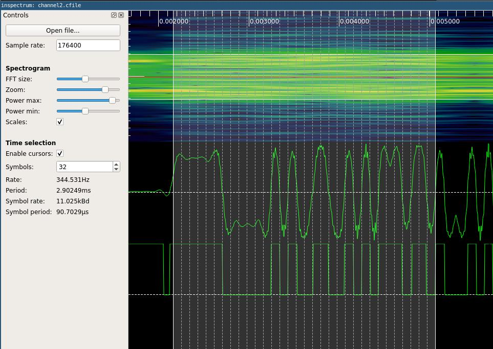

# Phasors to Kill

## Communication Systems

*245 points, 9 solves*

Active ADDVulcan players:

- lennert
- miek
- schneider
- Sec
- sharebrained
- worm

# Challenge Description

Stunned you figured out that first [SDR](https://en.wikipedia.org/wiki/Software-defined_radio) capture? Time to hack harder to get this flag.

## Ticket

...

## Solving

Your team's flag for this challenge will look something like `flag{victor25864romeo:___a bunch of unguessable stuff___}`.

# Writeup by sharebrained

The challenge is to obtain the flag from a single [WAV file](challenge.wav).

We examine the WAV file and observe there are two channels.


We wrote a GNURadio flowgraph to modulate the signal so that it could be loaded into inspectrum.


Then we used inspectrum to extract the bits from each channel and post them as binary ([c1bits.txt](c1bits.txt) and [c2bits.txt](c2bits.txt)) and hex ([c1bits.hex](c1bits.hex) and [c2bits.hex](c2bits.hex)) to the chat for everybody to pick through.



A repeating pattern is identified in both of the channels (period=440 bits), but no plaintext. We try interleaving and XORing the channels, to no avail. Then we notice that the two channels repeat the same data but with a considerable offset. There's also a periodic inversion in the data pattern. We entertain the notion of this being a differential encoding, like [DQPSK](https://en.wikipedia.org/wiki/Phase-shift_keying#Quadrature_phase-shift_keying_(QPSK)). But then, there are characteristics that seem to preclude differential encoding.

Here's an example attempt to find plaintext in the data, using `flag` in normal and inverted bit representations, and different interleaving techniques.

```python
flag =  '01100110011011000110000101100111'
nflag = '10011001100100111001111010011000'
data = open('c.bin').readlines()

c1 = data[0].strip()
c2 = data[1].strip()

inter = ""
for i in range(0, len(c1)):
    inter += c1[i] + c2[i]
    #inter += c2[i] + c1[i]

print (flag in inter)
print (nflag in inter)

diff = ''
for i in range(0, len(inter)-1):
    if inter[i] == inter[i+1]:
        diff += '0'
    else:
        diff += '1'

print (flag in diff)
print (nflag in diff)
```

We observed that the repeating pattern of 880 bits (when interleaving both channels) would be exactly the length of a flag string (110 characters x 8 bits). So we're clearly looking for a flag in this data, and it likely doesn't have any encapsulation or encoding overhead.

Again, the notion of QPSK (possibly with [Gray coding](https://en.wikipedia.org/wiki/Gray_code)) is discussed. Various encodings of `flag` are prepared and used to search the bit strings.

```
01110111 01110000 10000010 11101100
 A C A C  A C D D  B D D B  C B C D
01100110 01101100 01100001 01100111 01111011
 A B A B  A B C D  A B D A  A B A D
```

[Entropy](https://en.wikipedia.org/wiki/Entropy_(information_theory)) is calculated for a couple different views of the bits. Nothing conclusive is found.

```
./entropy.pl c1
0: 46.36%
1: 47.27%
2: 50.00%
3: 56.36%
4: 47.27%
5: 51.82%
6: 54.55%
7: 53.64%

# With bit inversion (what was inverted, and how?)
./entropy.pl c1
0: 50.00%
1: 50.00%
2: 50.00%
3: 50.00%
4: 50.00%
5: 50.00%
6: 50.00%
7: 50.00%
8: 50.00%
9: 50.00%
10: 50.00%
11: 50.00%
12: 50.00%
13: 50.00%
14: 50.00%
15: 50.00%

# With differential decoding
./entropy.pl c1
1: 36.36%
2: 66.36%
3: 39.09%
4: 51.82%
5: 40.00%
6: 60.91%
7: 44.55%
8: 50.00%
```

After all the talk of QPSK, a [GNU Radio](https://www.gnuradio.org/) [flow graph](gnuradio/phasors-to-kill.grc) is constructed to perform several variants of QPSK demodulation (combinations of Gray and differential encoding).


The [output file](gnuradio/out.dat) is run through a [simple Python bit-packer](pack.py) to create binary files with different packing bit offsets.

```python
import sys
import numpy

file_in_path = sys.argv[1]

d = numpy.fromfile(file_in_path, dtype=numpy.uint8)

for i in range(8):
	p = numpy.packbits(d[i:])
	file_out_path = 'packed_o{:01d}.bin'.format(i)
	p.tofile(file_out_path)
```

Each of the packed binary files is searched for `flag`.

```
$ grep -i flag packed_o*.bin
Binary file packed_o6.bin matches
```

We search for strings in the [one file that matched](packed_o6.bin).

```
$ strings packed_o6.bin 
lag{victor25864romeo:GF8529D6cdixxZSh78pUBXCs6K6u8iYF9nVijHhAmbsv4bsMbzn8uj1qSaCr-O0sL-SDbbeGdgYFT3TQ7xzs_Us}flag{victor25864romeo:GF8529D6cdixxZSh78pUBXCs6K6u8iYF9nVijHhAmbsv4bsMbzn8uj1qSaCr-O0sL-SDbbeGdgYFT3TQ7xzs_Us}flag{victor25864romeo:GF8529D6cdixxZSh78pUBXCs6K6u8iYF9nVijHhAmbsv4bsMbzn8uj1qSaCr-O0sL-SDbbeGdgYFT3TQ7xzs_Us}flag{victor25864romeo:GF8529D6cdixxZSh78pUBXCs6K6u8iYF9nVijHhAmbsv4bsMbzn8uj1qSaCr-O0sL-SDbbeGdgYFT3TQ7xzs_Us}flag{victor25864romeo:GF8529D6cdixxZSh78pUBXCs6K6u8iYF9nVijHhAmbsv4bsMbzn8uj1qSaCr-O0sL-SDbbeGdgYFT3TQ7xzs_Us}flag{victor25864romeo:GF8529D6cdixxZSh78pUBXCs6K6u8iYF9nVijHhAmbsv4bsMbzn8uj1qSaCr-O0sL-SDbbeGdgYFT3TQ7xzs_Us}flag{victor25864romeo:GF8529D6cdixxZSh78pUBXCs6K6u8iYF9nVijHhAmbsv4bsMbzn8uj1qSaCr-O0sL-SDbbeGdgYFT3TQ7xzs_Us}flag{victor25864romeo:GF8529D6cdixxZSh78pUBXCs6K6u8iYF9nVijHhAmbsv4bsMbzn8uj1qSaCr-O0sL-SDbbeGdgYFT3TQ7xzs_Us}flag{victor25864romeo:GF8529D6cdixxZSh78pUBXCs6K6u8iYF9nVijHhAmbsv4bsMbzn8uj1qSaCr-O0sL-SDbbeGdgYFT3TQ7xzs_Us}flag{victor25864romeo:GF8529D6cdixxZSh78pUBXCs6K6u8iYF9nVijHhAmbsv4bsMbzn8uj1qSaCr-O0sL-SDbbeGdgYFT3TQ7xzs_Us}flag{victor25864romeo:GF8529D6cdixxZSh78pUBXCs6K6u8iYF9nVijHhAmbsv4bsMbzn8uj1qSaCr-O0sL-SDbbeGdgYFT3TQ7xzs_Us}flag{victor25864romeo:GF8529D6cdixxZSh78pUBXCs6K6u8iYF9nVijHhAmbsv4bsMbzn8uj1qSaCr-O0sL-SDbbeGdgYFT3TQ7xzs_Us}flag{victor25864romeo:GF8529D6cdixxZSh78pUBXCs6K6u8iYF9nVijHhAmbsv4bsMbzn8uj1qSaCr-O0sL-SDbbeGdgYFT3TQ7xzs_Us}flag{victor25864romeo:GF8529D6cdixxZSh78pUBXCs6K6u8iYF9nVijHhAmbsv4bsMbzn8uj1qSaCr-O0sL-SDbbeGdgYFT3TQ7xzs_Us}flag{victor25864romeo:GF8529D6cdixxZSh78pUBXCs6K6u8iYF9nVijHhAmbsv4bsMbzn8uj1qSaCr-O0sL-SDbbeGdgYFT3TQ7xzs_Us}flag{victor25864romeo:GF8529D6cdixxZSh78pUBXCs6K6u8iYF9nVijHhAmbsv4bsMbzn8uj1qSaCr-O0sL-S
```

Bingo! We have our flag!

```
flag{victor25864romeo:GF8529D6cdixxZSh78pUBXCs6K6u8iYF9nVijHhAmbsv4bsMbzn8uj1qSaCr-O0sL-SDbbeGdgYFT3TQ7xzs_Us}
```
