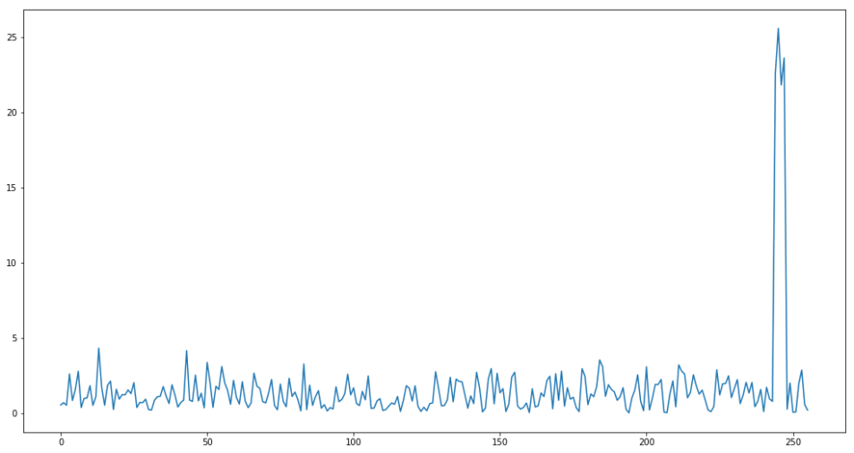

# Leaky Crypto
## Payload Modules

*205 points, 13 solves*

My crypto algorithm runs in constant time, so I'm safe from sidechannel leaks, right?


# Challenge Description

My crypto algorithm runs in constant time, so I'm safe from sidechannel leaks, right?

Note: To clarify, the sample data is plaintext inputs, NOT ciphertext

### Files
You'll need these files to solve the challenge.

* [test.txt](./test.txt)
* [readme.txt](./readme.txt)


### Solving
Your team's flag for this challenge will look something like flag{uniform54349juliet:___a bunch of unguessable stuff___}


### Contents of readme.txt
```
Hello, fellow space enthusiasts!

I have been tracking a specific satellite and managed to intercept an interesting 
piece of data. Unfortunately, the data is encrypted using an AES-128 key with ECB-Mode.

Encrypted Data: 7972c157dad7b858596ecdb798877cc4ed4b03d6822295954e69b7ecebb704af08c054a03a374f8bdaa18ff16ba09be2b6b25f1ef73ef80111646de84cd3af2514501e056889e95c680f7d199b6531e9dd6ee599aeb23835327e6e853a9a40a9f405bd1443e014363ea46631582b97c3d3f83f4e1101da2557f9b03808a61968

Using proprietary documentation, I have learned that the process of generating the 
AES key always produces the same first 6 bytes, while the remaining bytes are random:

Key Bytes 0..5: 97ca6080f575

The communication protocol hashes every message into a 128bit digest, which is encrypted
with the satellite key, and sent back as an authenticated ACK. This process fortunately 
happens BEFORE the satellite attempts to decrypt and process my message, which it will
immediately drop my message as I cannot encrypt it properly without the key.

I have read about "side channel attacks" on crypto but don't really understand them, 
so I'm reaching out to you for help. I know timing data could be important so I've 
already used this vulnerability to collect a large data set of encryption times for 
various hash values. Please take a look!
```

# Writeup by Lennert
The provided [readme.txt](./readme.txt) contains some interesting information. We know that the flag is encrypted using the Advanced Encryption Standard (AES) with a 16-byte key, employed in the Electronic Code Book (ECB) mode of operation. As the key is not generated randomly we receive the first six bytes of key material as part of the challenge description.

Additionally, we are provided with a list of plaintexts and the time it took to compute the resulting ciphertext. The challenge description hints at the fact that we should exploit the timing information to conduct a side-channel attack.


## Literature
The first paper seemingly related to this challenge is the 2005 paper by Bernstein titled [Cache-timing attacks on AES](https://cr.yp.to/antiforgery/cachetiming-20050414.pdf). In this paper the author targets an AES T-tables implementation and exploits the timing variation introduced by the CPU's cache memory. The main reasoning for the attack described in this paper is that the time required to perform a table lookup will depend on the index. Specifically, Bernstein speculates that the table lookup T0[PT[0] ⊕ K[0]] will leak information about the the index (PT[0] ⊕ K[0]) through a timing side-channel.

The first six key bytes (provided in the [readme.txt](./readme.txt)) allow us to verify our hypothesis on how the implementation leaks exactly. I initially implemented the attack described above but was unable to use this method to recover the known key bytes. Additionally, there was no obvious pattern in the provided data which suggested that the information provided from one table lookup could be used to recover any of the other key bytes.

Searching for Cache-timing attacks on AES on Google or Google Scholar would eventually lead you to the paper titled [Cache-collision timing attack against AES](http://www.jbonneau.com/doc/BM06-CHES-aes_cache_timing.pdf) (CHES 2006) by Bonneau and Mironov. Or alternatively you could also find a [Youtube video](https://www.youtube.com/watch?v=_06jRYrgUFU) which explains the same idea.

As the title suggests, this cache-timing side-channel attack relies on a collision. Specifically, the main idea is that there will be an observable timing difference when processing T0[PT[0] ⊕ K[0]] and T0[PT[4] ⊕ K[4]] if a collision (PT[0] ⊕ K[0] == PT[4] ⊕ K[4]) occurs.

## How it works

Describing all of the inner workings of the AES is beyond the scope of this writeup, but plenty of resources are available online. However, to understand the attack it is important to know that this specific implementation uses four lookup tables, often referred to as T-tables. Each of these tables is used for one column of the AES state.

| T0    | T1    | T2    | T3   |
|-------------|-------------|-------------|-------------|
|PT[0] ⊕ K[0]|PT[1] ⊕ K[1]|PT[2] ⊕ K[2]|PT[3] ⊕ K[3]|
|PT[4] ⊕ K[4]|PT[5] ⊕ K[5]|PT[6] ⊕ K[6]|PT[7] ⊕ K[7]|
|PT[8] ⊕ K[8]|PT[9] ⊕ K[9]|PT[10] ⊕ K[10]|PT[11] ⊕ K[11]|
|PT[12] ⊕ K[12]|PT[13] ⊕ K[13]|PT[14] ⊕ K[14]|PT[15] ⊕ K[15]|


The basic idea behind the attack is that when the table lookup T0[ PT[0] ⊕ K[0] ] is performed, part of the table T0 will be loaded into the cache. Afterwards, when we perform T0[ PT[4] ⊕ K[4] ] we might observe a cache hit if PT[4] ⊕ K[4] is the same as (or close to) PT[0] ⊕ K[0]. If PT[4] ⊕ K[4] is not equal to PT[0] ⊕ K[0] it will take longer to perform the table lookup. In other words, if there is a collision between PT[0] ⊕ K[0] and PT[4] ⊕ K[4] the table lookup will be faster resulting in timing side-channel leakage.

### Exploiting the timing leakage
As part of the challenge description we received the first 6 bytes of the key. We can use the known value for key byte 0 to try and recover key byte 4 and verify that it matches with the provided value for key byte 4.

For each of the provided measurements we can compute the correct value of PT[0] ⊕ K[0]. We calculate PT[4] ⊕ K[4] for all of the 256 possible values of K[4]. For each of the key guesses we can average the timing measurements for which the value of PT[0] ⊕ K[0] is equal to PT[4] ⊕ K[4], as well as average the time for all other measurements. For a few of the key guesses we expect to see a bigger difference between both of these averages, these will be our candidates for key byte 4. 

The following plot shows the difference of means (y-axis) vs the value of the key guess (x-axis). 


The top 4 candidates for this key byte are 0xF5, 0xF7, 0xF4 and 0xF6. This list of candidates contains the known value for key byte 4 (0xF5), a good indicator that we are on the right track to solve this challenge!

Similarly we can retrieve candidates for most of the other key bytes:
|Key byte|candidates|
|--------|----------|
|0|0x97|
|1|0xCA|
|2|0x60|
|3|0x80|
|4|0xF5|
|5|0x75|
|6|0xE6, 0xE4, 0xE5, 0xE7|
|7|0x46, 0x47, 0x44, 0x45|
|8|0xE4, 0xE7, 0xE6, 0xE5|
|9|0x54, 0x57, 0x55, 0x56|
|10|0xF4, 0xF5, 0xF7, 0xF6|
|11||
|12|0xBC, 0xBE, 0xBD, 0xBF|
|13|0x15, 0x17, 0x16, 0x14|
|14|0x68, 0x69, 0x6B, 0x6A|
|15|0x5E, 0x5C, 0x5D, 0x5F|

For more details on how these key bytes were recovered and the full implementation you can look at the provided Python [notebook](./leaky-crypto.ipynb). It's not completely clear to my why collisions between certain bytes resulted in successful key byte recovery.

At this point the remaining key space could be brute forced using a known plaintext ciphertext pair which was provided as part of the challenge in the form of the encrypted flag and the flag structure.
The recovered key was `97ca6080f575e646e557f755bf15685e` and the resulting decrypted flag was `flag{uniform54349juliet:GL2aGs7ys8ygcW0kFBPLbwEdjLbwNltiPdX_ANqtOFbUpEh_ciY8tWZd4y2VblkUhOl-PxXJdJYK86pIHmmwcw0}`

