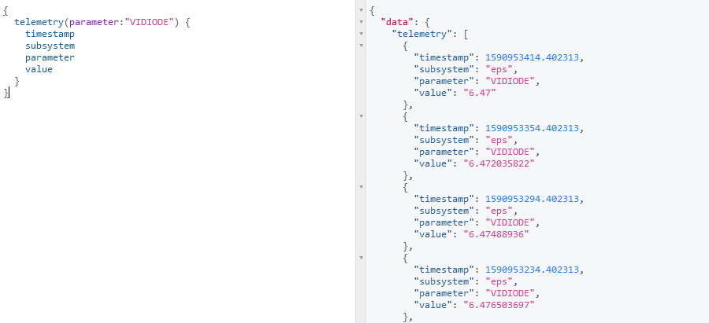
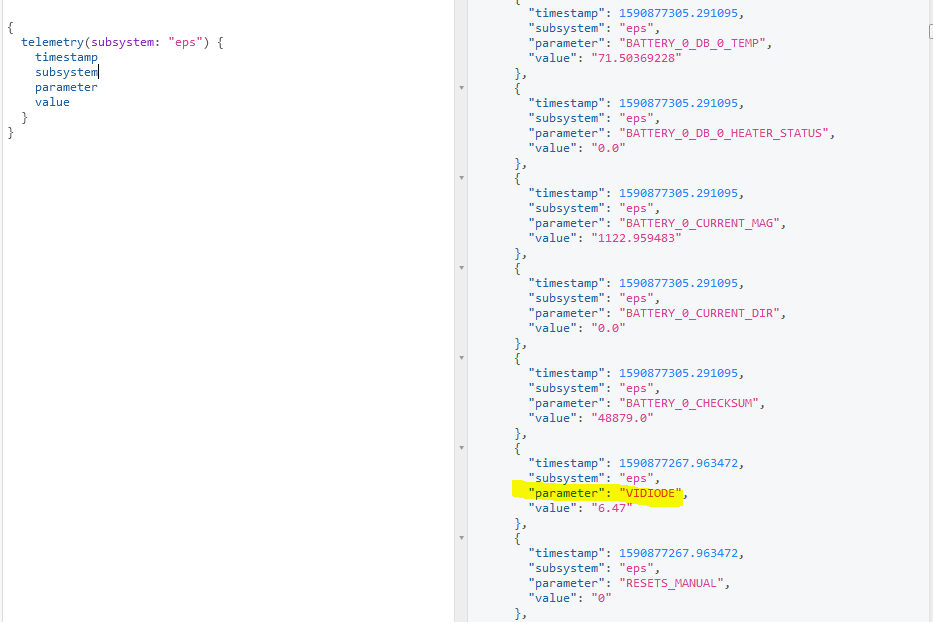
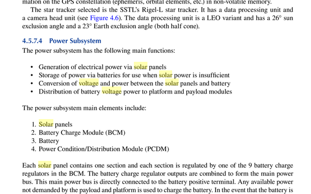
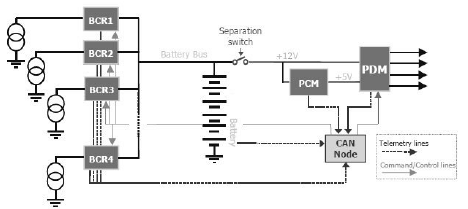
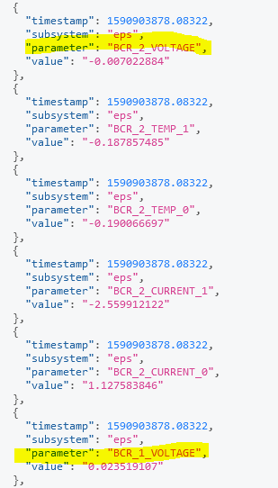

# SpaceDB

## Payload Modules

*79 points, 53 solves*

Active ADDVulcan players:

- Lennert
- kandi3kan3
- dtechshield

# Challenge Description

The last over-the-space update seems to have broken the housekeeping on our satellite. 
Our satellite's battery is low and is running out of battery fast. 
We have a short flyover window to transmit a patch or it'll be lost forever. 
The battery level is critical enough that even the task scheduling server has shutdown. 
Thankfully this can be fixed without any exploit knowledge by using the built in APIs provided by https://www.kubos.com.
Hopefully we can save this one!

Note: When you're done planning, go to low power mode to wait for the next transmission window


### Ticket

Present this ticket when connecting to the challenge:

```
ticket{xray61861echo:GHUXJ498f89DPs9ZZR5ZT2LX3JR9Gw9D61ngX-jIfZIW4eDZ2HM94F230DSyX7Hjhw}
```

Don't share your ticket with other teams.

### Connecting

Connect to the challenge on 

```
spacedb.satellitesabove.me:5062
``` 

Using netcat, you might run 
```
nc spacedb.satellitesabove.me 5062
``` 

### Solving

Your team's flag for this challenge will look something like flag{xray61861echo:___a bunch of unguessable stuff___} . 


# Writeup by dtechshield

We connect to the server and provide our ticket, started seeing the below output:

```
root# nc spacedb.satellitesabove.me 5062
Ticket please:
ticket{xray61861echo:GHUXJ498f89DPs9ZZR5ZT2LX3JR9Gw9D61ngX-jIfZIW4eDZ2HM94F230DSyX7Hjhw}
### Welcome to kubOS ###
Initializing System ...

** Welcome to spaceDB **
-------------------------

req_flag_base  warn: System is critical. Flag not printed.

critical-tel-check  info: Detected new telemetry values.
critical-tel-check  info: Checking recently inserted telemetry values.
critical-tel-check  info: Checking gps subsystem
critical-tel-check  info: gps subsystem: OK
critical-tel-check  info: reaction_wheel telemetry check.
critical-tel-check  info: reaction_wheel subsystem: OK.
critical-tel-check  info: eps telemetry check.
critical-tel-check  warn: VIDIODE battery voltage too low.
critical-tel-check  warn: Solar panel voltage low
critical-tel-check  warn: System CRITICAL.
critical-tel-check  info: Position: GROUNDPOINT
critical-tel-check  warn: Debug telemetry database running at: 3.19.141.137:17501/tel/graphiql
```

Upon connection we immediately noticed a few things:
1. that we are dealing with a kubOS based system (also per challenge description)
2. We have low voltage issues in VIDIODE and Solar Panels
3. System is in CRITICAL state
4. Position is at GROUNDPOINT
5. And of course - we needed to connect to the telemetry database at ```3.19.141.137:17501/tel/graphiql```

We connected to `3.19.141.137:17501/tel/graphiql` and got a query/response interface for GraphiQL...

OSINT time...\
The team started searching on [kubOS](https://docs.kubos.com/)' telemetry operations: [https://docs.kubos.com/1.21.0/tutorials/querying-telemetry.html](https://docs.kubos.com/1.21.0/tutorials/querying-telemetry.html)

We started playing with various commands and learning to change various telemetry values - during this time we noticed that the telemetry server had time window and we were timing out - so we had to be quick.

It took a quite a few tries to get comfortable with the command syntax - our first goal was to be able to query a specific telemetry parameter in this case VIDIODE...

First we found this example:

```
query {
    telemetry(timestampGe: Float, timestampLe: Float, subsystem: String, parameter: String, parameters: [String], limit: Integer): [{
        timestamp: Float!
        subsystem: String!
        parameter: String!
        value: String!
    }]
}
```


We learned how to query the system and given that our initial target was VIDIODE - we issued the following query to directly get the VIDIODE parameter value:



Not much there, then we queried the Electrical Power System (EPS):



It gave us bunch of values, but it was not clear initially which one(s) we needed to tweak to make the system function the way needed...


Still we needed to understand the power systems that impacted the EPS subsystem - Google to the rescue:
we found a book on [Hyperspectral Satellites and System Design](https://books.google.com/books?id=5VraDwAAQBAJ&pg=PA217&lpg=PA217&dq=PDM+voltage+solar&source=bl&ots=F8XaPLB6HQ&sig=ACfU3U1AnD8CORH5faMJ1jrHuX6JrBeW6Q&hl=en&sa=X&ved=2ahUKEwjzlM3B19zpAhXvGDQIHVu6Du8Q6AEwBXoECBsQAQ#v=onepage&q=PDM%20voltage%20solar&f=false) by Shen-En Qian

Page 216 - Section 4.5.7.4 had some discussion on the Power Subsystem - and we noticed a discussion on the Battery Control Module (BCM) (see below) and got some inspiration.



Then we found: [Miniaturised Power and Propulsion for Small, Low Cost Space Exploration Missions](http://cap.ee.ic.ac.uk/~pdm97/powermems/2005/pdfs/147_Baker.pdf)

Scanning quickly through the paper we saw: 

```
Each solar panel supplies an independent BCR implementing maximum-power-point tracking in hardware for optimum power transfer efficiency. (Page 3)
```

And found the following diagram:





Solar panels charge the batteries, BCR controls the voltage - we have low voltage - time to search for BCR in the EPS subsystem:


```
{
  telemetry(subsystem:"eps") {
    timestamp
    subsystem
    parameter
    value
  }
}
```

And we found four BCR voltage values (BCR_1_VOLTAGE, BCR_2_VOLTAGE, BCR_3_VOLTAGE, BCR_4_VOLTAGE):



After figuring out the [bulk insert](https://docs.kubos.com/1.18.0/ecosystem/services/telemetry-db.html?highlight=insertbulk) from kubOS documents into the telemetry database we issued the following query:

```
mutation {
    insertBulk(timestamp: 1590224800.769909, entries:[
          { subsystem: "eps", parameter: "VIDIODE", value: "8.00" },
          { subsystem: "eps", parameter: "BCR_0_VOLTAGE", value: "21.00" },
          { subsystem: "eps", parameter: "BCR_1_VOLTAGE", value: "21.00" },
          { subsystem: "eps", parameter: "BCR_2_VOLTAGE", value: "21.00" },
          { subsystem: "eps", parameter: "BCR_3_VOLTAGE", value: "21.00" },
          { subsystem: "eps", parameter: "BCR_4_VOLTAGE", value: "21.00" }
    ])
      {
        success
        errors
    }
}
```

It became apparent that timestamp was an important value - and after learning how to look up time:


```
query {telemetry {timestamp}}
```


We issued the following with the correct timestamp - `correct_timestamp = query {telemetry {timestamp}} + 1s (sometimes 2seconds)`

```
mutation {
    insertBulk(timestamp: 1590227491.769909, entries:[
          { subsystem: "eps", parameter: "VIDIODE", value: "8.00" },
          { subsystem: "eps", parameter: "BCR_0_VOLTAGE", value: "21.00" },
          { subsystem: "eps", parameter: "BCR_1_VOLTAGE", value: "21.00" },
          { subsystem: "eps", parameter: "BCR_2_VOLTAGE", value: "21.00" },
          { subsystem: "eps", parameter: "BCR_3_VOLTAGE", value: "21.00" },
          { subsystem: "eps", parameter: "BCR_4_VOLTAGE", value: "21.00" }
    ])
      {
        success
        errors
    }
}
```

And on the console we noticed that a new service caller `Scheduler service` came online:


We went to `3.21.75.121:14733/sch/graphiql` on our browsers...


Scheduling mode proved to be very moody - it kept shutting down and we had to go back to the telemetry database and re-enable the scheduling service. Trying too many times caused a `Battery critical` condition resulting in a system shutdown.


After many tries we figured out the sequence:

Based on the challenge description we knew we had to schedule a task for going into `low power` mode and that we needed to `transmit`.

First we started playing with the `low power` mode - after many tries two things became apparent:
1. Timestamp had to be accurate
2. Sequence of commands had to be accurate 

Here is our full action list:

1. A task to go into `low power` mode:

```
mutation {
    importRawTaskList(
        name: "nominal-op",
        mode: "low_power",
        json: "{\"tasks\":[{\"description\":\"a\",\"delay\":\"10s\",\"app\": {\"name\":\"disable_downlink\"}},{\"description\":\"b\",\"delay\":\"15s\",\"app\": {\"name\":\"sunpoint\"}},{\"description\":\"b\",\"delay\":\"20s\",\"app\": {\"name\":\"low_power\"}},{\"description\":\"e\",\"delay\":\"25s\",\"app\": {\"name\":\"request_flag_telemetry\"}},{\"description\":\"b\",\"time\":\"2020-05-23 14:36:14\",\"app\": {\"name\":\"activate_station-keeping_mode\"}}]}"
    ) {
        success,
        errors
    }
}
```

2. A task to initiate `transmission` mode - notice the timestamps... 

```
mutation {
    importRawTaskList(
        name: "nominal-op",
        mode: "transmission",
        json: "{\"tasks\":[{\"description\":\"c\",\"time\":\"2020-05-23 13:49:09\",\"app\": {\"name\":\"groundpoint\"}},{\"description\":\"d\",\"time\":\"2020-05-23 13:49:29\",\"app\": {\"name\":\"enable_downlink\"}},{\"description\":\"e\",\"time\":\"2020-05-23 13:49:35\",\"app\": {\"name\":\"request_flag_telemetry\"}},{\"description\":\"a\",\"time\":\"2020-05-23 13:49:39\",\"app\": {\"name\":\"disable_downlink\"}},{\"description\":\"b\",\"time\":\"2020-05-23 13:49:45\",\"app\": {\"name\":\"sunpoint\"}}]}"
    ) {
        success,
        errors
    }
}
```

3. Activate the `low power` mode

```
mutation {
  activateMode(name: "low_power") {success errors}
}
```

4. Activate the `transmission` mode

```
mutation {
  activateMode(name: "transmission") {success errors}
}
```


And the console started to output the results of our actions and gave us the flag:

```
Low_power mode enabled.
Timetraveling.

Transmission mode enabled.

Pointing to ground.
Transmitting...

----- Downlinking -----
Recieved flag.
flag{xray61861echo:GNyiclE4-uuekmThALSQA1kYnhuRX6BBx4MXvF8CeAT2clv1bv0meYVo1Q1iOXaCq7Co-NxZTKgTFI0pzSC1LTY}

Downlink disabled.
Adjusting to sunpoint...
Sunpoint: TRUE
Goodbye
```

